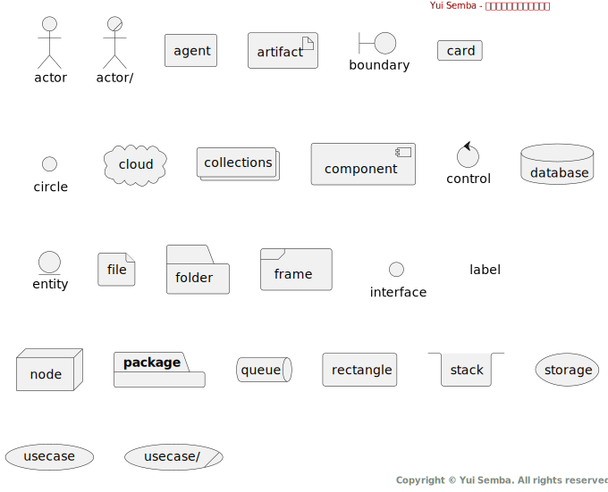

# 機能ID / 機能名

## 機能概要

- 機能の概要を箇条書きで記載する。
- 機能の概要を箇条書きで記載する。

## 業務フロー別シナリオ一覧

| シナリオID | シナリオ名 | 概要 | 主なアクター |
|:-------|:------|:---|:-------|
|        |       |    |        |

## 業務フロー図

### S001 / シナリオ名

