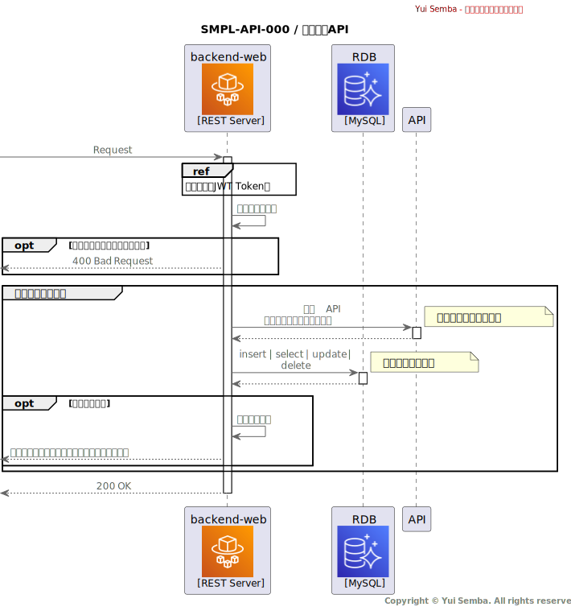

# SMPL-API-000 / 〇〇取得API

## 機能概要

- どのテーブルをどんな条件で取得するかを明確にしたい。
- どのテーブルをどんな条件で更新するかを明確にしたい。
- 業務チェックなどでエラーになる条件とメッセージコードなどを明確にしたい。
- 返却するメッセージで単純な入れ替えではない値の設定仕様などがあれば明確にしたい。

## IF 定義

[OpenAPI](../../../interface/open-api/)

## シーケンス

## 処理詳細

### バリデーション

リクエストパラメータのバリデーションを行う。

### XXX取得処理

~のため、`XXX（テーブル名）` を検索する。  
ここで取得したXXX情報は以降「 XXX情報」と呼称する。

#### パラメータ一覧

| No | 対象        | 条件                             |
|---:|:----------|:-------------------------------|
|  1 | `XXX.col` | `Request.body.Property` と 完全一致 |
|  2 | `XXX.col` | 固定値 `*` と完全一致                  |

取得できなった場合、 `404: Not Found` を返却する。

#### エラーレスポンス作成

| No | 対象                       | 処理                                    |
|---:|:-------------------------|:--------------------------------------|
|  1 | `Response.body.Property` | `xxx.col` と `yyy.col` を結合して設定         |
|  2 | `Response.body.Property` | `xxx.col` を `YYYYMMDD` で文字列フォーマットして設定 |

### YYY取得処理

~のため、`YYY（テーブル名）` を検索する。  
ここで取得したYYY情報は以降「 YYY情報」と呼称する。

#### パラメータ一覧

| No | 対象        | 条件                             |
|---:|:----------|:-------------------------------|
|  1 | `YYY.col` | `Request.body.Property` と 完全一致 |
|  2 | `YYY.col` | 固定値 `*` と完全一致                  |

取得できなった場合、 `404: Not Found` を返却する。

#### エラーレスポンス作成

| No | 対象                       | 処理                                    |
|---:|:-------------------------|:--------------------------------------|
|  1 | `Response.body.Property` | `yyy.col` と `yyy.col` を結合して設定         |
|  2 | `Response.body.Property` | `yyy.col` を `YYYYMMDD` で文字列フォーマットして設定 |

### レスポンス作成処理

取得した `XXX` と `YYY` のレコードを編集して返却する。

| No | 対象                       | 処理                                    |
|---:|:-------------------------|:--------------------------------------|
|  1 | `Response.body.Property` | `xxx.col` と `yyy.col` を結合して設定         |
|  2 | `Response.body.Property` | `xxx.col` を `YYYYMMDD` で文字列フォーマットして設定 |
