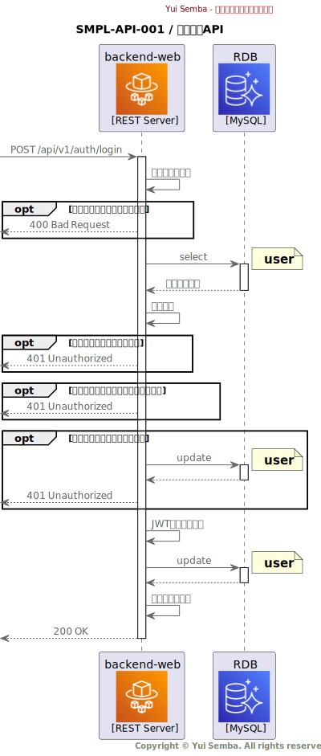

# SMPL-API-001 / ログインAPI

## 機能概要

- ユーザー名とパスワードによる認証を行うAPI
- 認証に成功した場合はJWTトークンを発行する
- 存在しないユーザー名、またはパスワードが不正な場合はエラーを返す
- アカウントがロックされている場合はエラーを返す

## IF 定義

[OpenAPI](https://yui-semba-sample-docs.netlify.app/02_backend/interface/open-api/output/sample-oas.html)

## シーケンス

## 処理詳細

### バリデーション

リクエストパラメータのバリデーションを行う。

### ユーザー情報取得処理

認証処理のため、`user`（ユーザー）テーブルを検索する。  
ここで取得したユーザー情報は以降「ユーザー情報」と呼称する。

#### 検索条件

| No | 対象                | 条件                            |
|---:|:------------------|:------------------------------|
|  1 | `user.username`   | `Request.body.username` と完全一致 |
|  2 | `user.deleted_at` | `NULL`                        |

ユーザーが存在しない場合、`401 Unauthorized` を返却する。

#### エラーレスポンス作成

| No | 対象                            | 設定値                           |
|---:|:------------------------------|:------------------------------|
|  1 | `Response.body.error_code`    | `invalid_credentials` を設定     |
|  2 | `Response.body.error_message` | `ユーザー名またはパスワードが正しくありません。` を設定 |

### アカウントロックチェック

`lock_out_end` が現在時刻よりも後の場合（アカウントがロックされている場合）、`401 Unauthorized` を返却する。

#### エラーレスポンス作成

| No | 対象                            | 設定値                           |
|---:|:------------------------------|:------------------------------|
|  1 | `Response.body.error_code`    | `invalid_credentials` を設定     |
|  2 | `Response.body.error_message` | `ユーザー名またはパスワードが正しくありません。` を設定 |

### パスワード検証

パスワードのハッシュ値を検証し、不一致の場合、アクセス失敗回数をインクリメントして `401 Unauthorized` を返却する。

#### パラメータ一覧

| No | 対象                    | 設定値                                                   |
|---:|:----------------------|:------------------------------------------------------|
|  1 | `access_failed_count` | 現在の値に1を加算                                             |
|  2 | `lock_out_end`        | `access_failed_count` が閾値を超えた場合、現在時刻からロックアウト時間後の時刻を設定 |

#### エラーレスポンス作成

| No | 対象                            | 設定値                           |
|---:|:------------------------------|:------------------------------|
|  1 | `Response.body.error_code`    | `invalid_credentials` を設定     |
|  2 | `Response.body.error_message` | `ユーザー名またはパスワードが正しくありません。` を設定 |

### JWT トークン生成

認証に成功した場合、JWTトークンを生成する。  
ここで生成したJWTトークンは以降「JWTトークン」と呼称する。

#### JWTヘッダー設定値

| No | 対象    | 設定値     |
|---:|:------|:--------|
|  1 | `alg` | `HS256` |
|  2 | `typ` | `JWT`   |

#### JWTペイロード設定値

| No | 対象    | 設定値                         |
|---:|:------|:----------------------------|
|  1 | `iss` | `okiden-backend-web`        |
|  2 | `sub` | `ユーザー情報.user_id`            |
|  3 | `aud` | `okiden-frontend-web`       |
|  4 | `exp` | 現在時刻 + `JWT_EXPIRATION_SEC` |
|  5 | `nbf` | 現在時刻                        |
|  6 | `iat` | 現在時刻                        |
|  7 | `jti` | UUIDv4                      |

#### JWT署名生成

| No | 項目   | 設定値              |
|---:|:-----|:-----------------|
|  1 | 署名キー | `JWT_SECRET_KEY` |

### ユーザー情報更新

認証に成功した場合、、`user`（ユーザー）テーブルのアクセス失敗回数をリセットする。

#### パラメータ一覧

| No | 対象                    | 設定値    |
|---:|:----------------------|:-------|
|  1 | `access_failed_count` | `0`    |
|  2 | `lock_out_end`        | `NULL` |

### レスポンス作成処理

認証に成功した場合、`200 OK` を返却する。

| No | 対象                    | 処理         |
|---:|:----------------------|:-----------|
|  1 | `Response.body.token` | `JWT トークン` |

## Appendix

### 利用する環境変数一覧

| No | 環境変数名                          | 説明                     | デフォルト値 |
|---:|:-------------------------------|:-----------------------|:-------|
|  1 | `JWT_SECRET_KEY`               | JWTトークン生成に使用する秘密鍵      | -      |
|  2 | `JWT_EXPIRATION_SEC`           | JWTトークンの有効期限（秒）        | `3600` |
|  3 | `ACCOUNT_LOCKOUT_THRESHOLD`    | アカウントロックの閾値となるアクセス失敗回数 | `5`    |
|  4 | `ACCOUNT_LOCKOUT_DURATION_SEC` | アカウントロックの持続時間（秒）       | `3600` |
