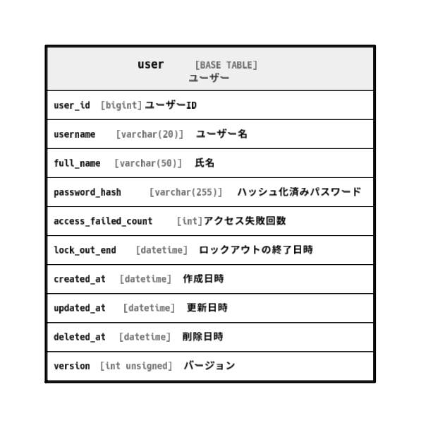

# user

## 概要

ユーザー

<details>
<summary><strong>テーブル定義</strong></summary>

```sql
CREATE TABLE `user` (
  `user_id` bigint NOT NULL AUTO_INCREMENT COMMENT 'ユーザーID',
  `username` varchar(20) NOT NULL COMMENT 'ユーザー名',
  `full_name` varchar(50) NOT NULL COMMENT '氏名',
  `password_hash` varchar(255) NOT NULL COMMENT 'ハッシュ化済みパスワード',
  `access_failed_count` int NOT NULL DEFAULT '0' COMMENT 'アクセス失敗回数',
  `lock_out_end` datetime DEFAULT NULL COMMENT 'ロックアウトの終了日時',
  `created_at` datetime NOT NULL DEFAULT CURRENT_TIMESTAMP COMMENT '作成日時',
  `updated_at` datetime NOT NULL DEFAULT CURRENT_TIMESTAMP ON UPDATE CURRENT_TIMESTAMP COMMENT '更新日時',
  `deleted_at` datetime DEFAULT NULL COMMENT '削除日時',
  `version` int unsigned NOT NULL DEFAULT '1' COMMENT 'バージョン',
  PRIMARY KEY (`user_id`)
) ENGINE=InnoDB DEFAULT CHARSET=utf8mb4 COLLATE=utf8mb4_0900_ai_ci COMMENT='ユーザー'
```

</details>

## カラム一覧

| #  | 名前                  | タイプ          | デフォルト値            | Nullable | Extra Definition                              | 子テーブル      | 親テーブル      | コメント                     |
| -- | ------------------- | ------------ | ----------------- | -------- | --------------------------------------------- | ---------- | ---------- | ------------------------ |
| 1  | user_id             | bigint       |                   | false    | auto_increment                                |            |            | ユーザーID                   |
| 2  | username            | varchar(20)  |                   | false    |                                               |            |            | ユーザー名                    |
| 3  | full_name           | varchar(50)  |                   | false    |                                               |            |            | 氏名                       |
| 4  | password_hash       | varchar(255) |                   | false    |                                               |            |            | ハッシュ化済みパスワード             |
| 5  | access_failed_count | int          | 0                 | false    |                                               |            |            | アクセス失敗回数                 |
| 6  | lock_out_end        | datetime     |                   | true     |                                               |            |            | ロックアウトの終了日時              |
| 7  | created_at          | datetime     | CURRENT_TIMESTAMP | false    | DEFAULT_GENERATED                             |            |            | 作成日時                     |
| 8  | updated_at          | datetime     | CURRENT_TIMESTAMP | false    | DEFAULT_GENERATED on update CURRENT_TIMESTAMP |            |            | 更新日時                     |
| 9  | deleted_at          | datetime     |                   | true     |                                               |            |            | 削除日時                     |
| 10 | version             | int unsigned | 1                 | false    |                                               |            |            | バージョン                    |

## 制約一覧

| # | 名前      | タイプ         | 定義                    |
| - | ------- | ----------- | --------------------- |
| 1 | PRIMARY | PRIMARY KEY | PRIMARY KEY (user_id) |

## INDEX一覧

| # | 名前      | 定義                                |
| - | ------- | --------------------------------- |
| 1 | PRIMARY | PRIMARY KEY (user_id) USING BTREE |

## ER図



---

> Generated by [tbls](https://github.com/k1LoW/tbls)
